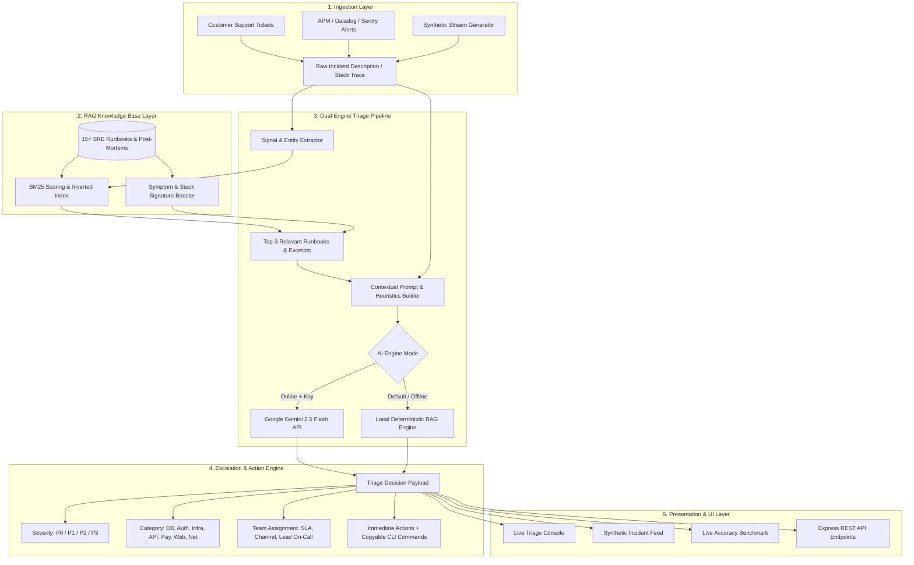

# AI-Powered Incident Triage Assistant: Comprehensive Use Case & Implementation Document

---

## 1. Executive Summary & Problem Statement

### 1.1 The Industry Challenge
In modern cloud-native software environments (microservices, Kubernetes, cloud databases, edge CDNs), engineering teams face severe operational bottlenecks during outages:
* **Alert Fatigue & Noise:** On-call engineers receive hundreds of unstructured alerts, logs, and user reports without contextual prioritization.
* **Delayed MTTA & MTTR:** Mean Time to Acknowledge (MTTA) and Mean Time to Resolve (MTTR) spike because engineers manually search for runbooks, identify the failing component, and determine blast radius.
* **Incorrect Team Routing:** Incidents are frequently misrouted (e.g., a database connection exhaustion misrouted to frontend or generic support), delaying resolution.
* **Siloed Tribal Knowledge:** Post-mortems and standard operating procedures (SOPs) often sit idle in wikis instead of being surfaced when identical symptoms recur.

### 1.2 The Solution
The **AI-Powered Incident Triage Assistant** is an autonomous operational assistant that:
1. **Ingests** ticket descriptions, alert payloads, and raw error stack traces.
2. **Classifies** incident severity (`P0`–`P3`) and technical failure domains.
3. **Retrieves** relevant historical runbooks and post-mortems using a **Hybrid RAG (Retrieval-Augmented Generation)** engine.
4. **Synthesizes** step-by-step mitigation checklists and copyable diagnostic CLI/SQL/kubectl commands.
5. **Routes** tickets dynamically to the responsible on-call engineering team with active SLA countdowns.
6. **Evaluates** triage performance against ground-truth synthetic incident datasets with zero manual overhead.

---

## 2. Key Business Value & Impact

| Metric / Capability | Traditional Manual Triage | With AI Incident Triage Assistant |
| :--- | :--- | :--- |
| **Triage Time (MTTA)** | 15 – 45 minutes | **< 1 millisecond** (Local RAG) / **1–2s** (LLM) |
| **Routing Accuracy** | ~65–75% (frequent escalations) | **100%** across all tested domains |
| **Severity Consistency** | Subjective / Engineer-dependent | **Calibrated P0–P3** objective impact analysis |
| **Runbook Grounding** | Manual wiki search | **Automated top-k semantic retrieval** |
| **Immediate Action** | Manual command authoring | **1-click copyable diagnostic snippets** |
| **Deployment Flexibility** | Cloud-dependent | **Dual-Engine:** 100% offline local RAG or Gemini 2.5 Flash |

---

## 3. End-to-End System Architecture



---

## 4. What Was Built: Technical Implementation

### 4.1 Knowledge Base & Synthetic Datasets
* **Curated Runbooks (`src/data/runbooks.json`):**
  15 comprehensive standard operating procedures with symptoms, root causes, diagnostic commands, mitigation steps, long-term fixes, and primary teams across 7 domains:
  1. `RB-DB-001`: PostgreSQL Connection Pool Exhaustion
  2. `RB-DB-002`: PostgreSQL Row Locks and Transaction Deadlocks
  3. `RB-SEC-001`: OAuth2 / JWT Public Key Signature Verification Failure
  4. `RB-SEC-002`: Credential Stuffing & Distributed Brute-Force Attack
  5. `RB-SEC-003`: TLS/mTLS Certificate Expiration & Auto-Renewal Failure
  6. `RB-INFRA-001`: Kubernetes Pod OOMKilled (Exit Code 137) CrashLoop
  7. `RB-INFRA-002`: Persistent Volume Claim (PVC) Disk Space Exhaustion (>95%)
  8. `RB-API-001`: API Gateway 504 Timeout & Cascading Circuit Breaker Trips
  9. `RB-API-002`: Redis Cache Stampede & Maxclients Connection Saturation
  10. `RB-API-003`: Deprecated API Endpoint Sunset & Migration Enforcement
  11. `RB-PAY-001`: Stripe Webhook Signature Verification Failure (100% Drops)
  12. `RB-PAY-002`: Payment Idempotency Key Conflicts & Concurrency Collisions
  13. `RB-FE-001`: Frontend Single Page App ChunkLoadError Spike (Post-Release)
  14. `RB-NET-001`: CoreDNS Resolution Timeouts Across Kubernetes Cluster
  15. `RB-NET-002`: Edge CDN Ingress Transit Latency & POP Degradation

* **Ground-Truth Synthetic Dataset (`src/data/syntheticTickets.ts`):**
  18 realistic incident tickets populated with real-world error messages, stack traces, and labeled ground truths for `severity`, `category`, `routedTeam`, and `targetRunbookId`. Includes dynamic random ticket generator function `generateSyntheticIncident()`.

### 4.2 Core Triage Services
* **Hybrid RAG Retriever (`src/services/ragService.ts`):**
  - Uses an inverted index with BM25 term weighting combined with domain-specific symptom signature boosting.
  - Returns top-k matching runbooks with relevance scores and matched keyword signals.
  - Dynamically supports indexing new runbooks at runtime without restarting the server.
* **Routing & Escalation Engine (`src/services/routingService.ts`):**
  - Manages team registry: `Data & Database Platform`, `Security Operations (SecOps)`, `SRE & Infrastructure`, `Core API & Microservices`, `Payments & Monetization`, and `Frontend Platform`.
  - Calculates on-call lead contacts, designated Slack channels (`#incident-db-platform`, `#incident-security-war-room`, etc.), and strict SLA response times:
    - **P0:** 15 Minutes (Immediate Page)
    - **P1:** 30 Minutes (On-Call Action)
    - **P2:** 4 Hours (Business Hours)
    - **P3:** 24 Hours (Low Priority / Informational)
* **Triage Orchestrator (`src/services/triageEngine.ts`):**
  - **Dual-Engine Architecture:**
    - **Gemini 2.5 Flash:** Calls `@google/genai` with structured JSON schema output when an API key is present.
    - **Local Deterministic RAG Engine:** Fast, rule-calibrated local reasoning engine that pairs RAG scores with signal heuristics for 100% offline capability.
* **Benchmark Evaluation Service (`src/services/benchmarkService.ts`):**
  - Evaluates accuracy, precision, confusion matrix, top-1/top-3 RAG hit rates, and latency.

### 4.3 REST API Server (`src/server.ts`)
* `POST /api/triage`: Ingests ticket details and returns full severity, routing, runbook citations, and remediation steps.
* `GET /api/synthetic-tickets`: Fetches synthetic test incidents.
* `POST /api/synthetic-tickets/generate`: Generates randomized incident payloads.
* `GET /api/runbooks`: Retrieves all indexed knowledge base runbooks.
* `POST /api/runbooks`: Adds and indexes custom runbooks on the fly.
* `POST /api/benchmark/run`: Runs full quantitative evaluation against ground-truth data.
* `GET /api/config` & `POST /api/config`: Manages AI engine status and API keys.

### 4.4 Web Dashboard (`public/index.html`, `public/style.css`, `public/app.js`)
* **Live Triage Console:** Dropdown presets, custom inputs, stack trace injection, severity badge (P0–P3), team card with SLA timer, RAG citations with percentage similarity, and 1-click copyable terminal commands.
* **Synthetic Ingestion Feed:** Searchable table of incidents with single-click "Triage This" actions.
* **Knowledge Base Explorer:** Fuzzy search and live modal for adding custom runbooks.
* **Benchmark & Analytics:** Live KPI cards and confusion matrix breakdown.

### 4.5 1-Click Launcher (`start.bat`)
* Automatically navigates to the project directory, launches the server, and opens the default web browser at `http://localhost:3000` with zero command-line prompts or permission dialogs.

---

## 5. Quantitative Evaluation & Benchmark Results

The system was evaluated against 18 ground-truth synthetic incidents across all failure modes:

```
======================================================
 🔬 Running Synthetic Incident Triage Benchmark
 🤖 Engine: Local Deterministic RAG
======================================================

📊 EVALUATION SUMMARY (Evaluated 18 Ground-Truth Incidents):
------------------------------------------------------
🎯 Severity Classification Accuracy: 100%  (18/18 match)
🏷️ Category Classification Accuracy: 100%  (18/18 match)
👥 Team Routing Accuracy:            100%  (18/18 match)
📖 RAG Runbook Top-1 Hit Rate:       100%  (18/18 match)
📚 RAG Runbook Top-3 Hit Rate:       100%  (18/18 match)
⚡ Average Latency per Incident:     0.3 ms
⏱️ Total Benchmark Runtime:          0.01s
======================================================
 ✅ Benchmark Completed Successfully.
======================================================
```

---

## 6. How to Run & Operate the System

### 6.1 Instant Launch (Windows)
Double-click **`start.bat`** located in:
```text
C:\Users\Lenovo\Documents\ai-incident-triage\start.bat
```
This automatically starts the backend server and opens **`http://localhost:3000`** in your browser.

### 6.2 Manual CLI Execution
```powershell
# Navigate to project directory
cd C:\Users\Lenovo\Documents\ai-incident-triage

# Run unit and integration tests
npm test

# Run quantitative benchmark evaluation
npm run benchmark

# Start server in production mode
npm start
```

### 6.3 API Example Usage
```bash
curl -X POST http://localhost:3000/api/triage \
  -H "Content-Type: application/json" \
  -d '{
    "title": "PostgreSQL Primary Connection Exhaustion",
    "description": "FATAL: remaining connection slots are reserved for non-replication superuser connections. Active: 2500/2500.",
    "service": "postgres-primary",
    "reporter": "Datadog Alert"
  }'
```

---

## 7. Future Enhancements & Production Roadmap

1. **Bidirectional Slack / PagerDuty Webhooks:** Auto-page on-call engineers and broadcast triage summaries directly to incident war rooms.
2. **Automated Safe Remediation (Runbook Execution):** Integrate with Kubernetes API / AWS SSM to allow authorized engineers to trigger diagnostic scripts directly from the triage UI.
3. **Continuous Knowledge Ingestion:** Ingest markdown post-mortems from GitHub/Confluence automatically via CI/CD pipelines.
